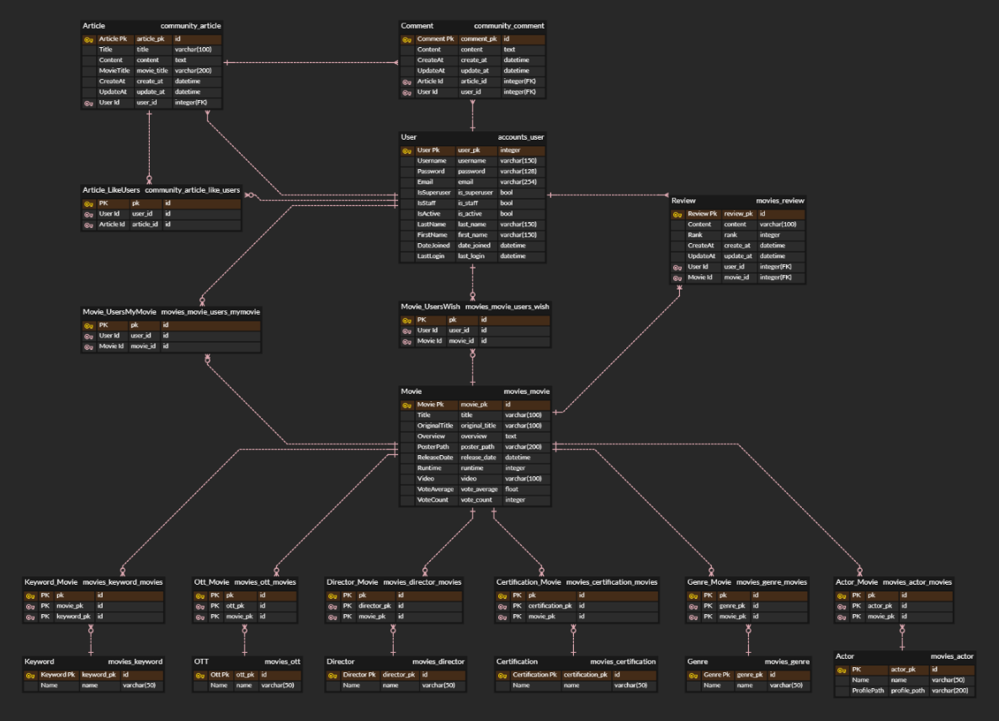
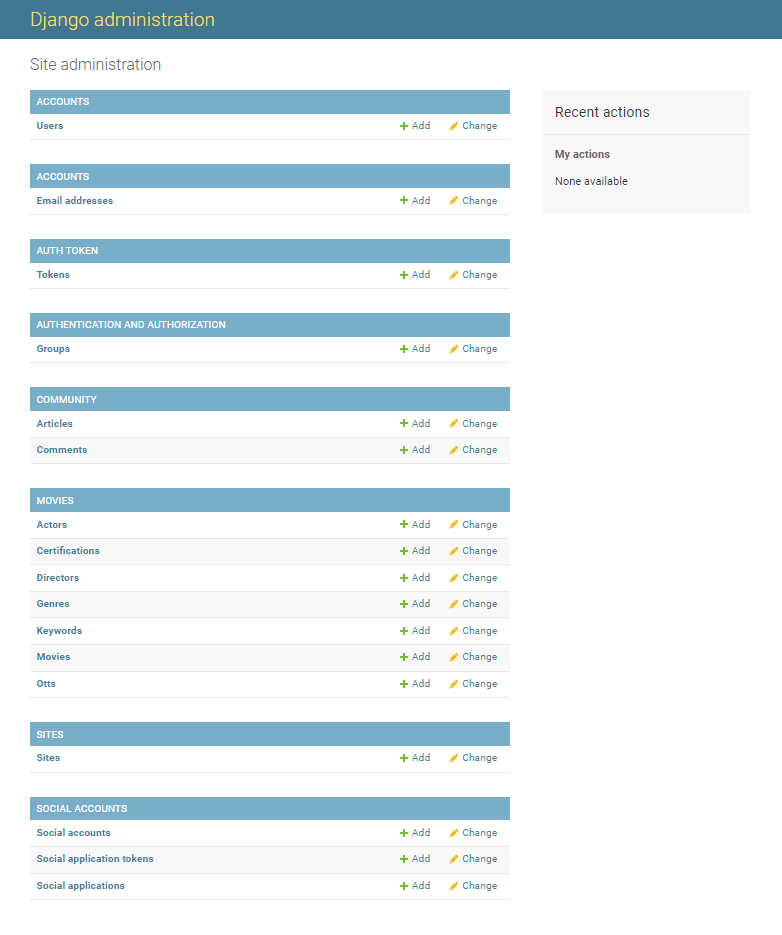

# Final Project

**Django REST API 서버 & Vue.js 를 활용한 영화 데이터 기반 추천, 커뮤니티 서비스 구성**


## 1. 업무 분담

> 제출일: 2022.05.27
>
> 팀장: 최수연
>
> 팀원: 이다인


### 협업 및 분업

**협업**

- 기획
  - 개발 환경 구성
  - 영화추천 알고리즘 기획 
  - 홈페이지 구상
- front-end (vue)
- back-end (django)


**분업**

최수연 

- Back-end(Django)
  - models.py 기획 및 작성
  - API를 활용한 데이터 수집
- Front-end(Vue.js)
  - 로고 디자인 및 레이아웃 작성
  - 프론트 담당(vue, css)
- 프로젝트
  - 일정 및 계획 정리(Trello)


이다인
- front-end (vue)
  - 장고와 Vue를 연결하기 위한 구조 구축
- back-end (django)
  - ERD 작성
  - serializer.py  작성


### 개발환경

- 언어
  - Python
  - Django
  - Vue.js
- 개발도구
  - Visual Studio Code
- 협업도구
  - Trello
  - Google Drive
- 아키텍쳐
  - Django REST API 서버 & Vue.js


## 2. 서비스 구현

### 목표

많은 유저들이 OTT 서비스를 이용하여 영화, 드라마를 감상하는 시대이다. 그러나 막상 OTT에 들어가면 무엇을 봐야할 지 고르다가 시간을 허비하는 경우가 많다. 따라서, 유저의 취향에 따라 유저가 고른 OTT에 들어있는 영화를 추천해주는 서비스를 제공하고자 한다.

뿐만 아니라, 유저가 본 영화의 데이터를 기반으로 유저가 좋아하는 감독, 많이 본 장르, 키워드에 따라 영화 추천 서비스를 제공한다. 

영화 디테일 페이지에 들어가면 다른 유저들과 의견을 공유할 수 있도록 댓글 및 평점 등록 기능을 구현하였다.

커뮤니티에서는 기자 권한을 가진 유저들이 영화 관련 기사 혹은 글을 작성하고, 댓글과 좋아요 기능을 통해 많은 유저들이 소통을 할 수 있는 서비스를 제공하고자 한다.


### 서비스 구현 계획

>  Accounts, Home, Recommend, Community

**Accounts**

- 회원가입/ 로그인/ 로그아웃
- 소셜 로그인
- 프로필


**Profile**

- 본 영화와 보고 싶은 영화, 좋아요 누른 글 보여주기


**Home**

- 영화 목록

  - Keyword별로 영화를 랜덤으로 추천

- 영화 Detail

  - 영화 제목 / 감독 / 줄거리 / 장르 / 관람 등급 / 개봉일 / 상영 시간 / 포스터 / 트레일러 / 배우 / 평점 

  - 내가 본 영화 / 보고 싶은 영화 프로필로 넘겨주기
  - 영화 리뷰 / 평점 주기


**Recommend**

- OTT 기반의 추천 알고리즘
- Keyword 기반의 추천 알고리즘
- 영화 감독에 따른 추천 알고리즘


**Community**

- 기자 권한을 가진 유저만 게시글을 쓸 수 있게 하여 타 사이트의 기사를 불러올 수 있게 함
- 기사에 대한 댓글 작성 및 좋아요 기능


**배포**

### 데이터 수집 방법

The Movie Database(TMDB)를 활용한 데이터 수집


### 실제 서비스 구현

**구현하지 못한 기능**

- 소셜 로그인
- 평점 tmdb 데이터와 연동
- Community에 기사 불러오기
- 배포


## 3. 데이터베이스 모델링 (ERD)

### ERD Preview


### ERD




### ERD 구조

- Movie와 Keyword / Ott / Director / Certification / Genre / Actor 연동
- Movie와 User 연동하여 mymovie / wish / review 보여줌
- Article과 Comment 연동
- User와 Comment 연동
- Article과 User 연동하여 article_likeusers 보여줌


## 4. 필수 기능

### 관리자 뷰

Django의 기본 admin 기능을 이용하여 구현하며 권리자 권한의 유저만 영화 등록 / 수정 / 삭제의 권한을 가진다.

```python
from django.contrib import admin
from .models import Movie, Genre, Certification, Actor, Director, OTT, Keyword, Review

admin.site.register(Movie)
admin.site.register(Genre)
admin.site.register(Certification)
admin.site.register(Actor)
admin.site.register(Director)
admin.site.register(OTT)
admin.site.register(Keyword)
admin.site.register(Review)
```


### 영화 정보

영화 데이터는 Database Seeding을 활용하여 282편의 영화 데이터가 존재하도록 구성했다.

로그인 된 유저는 영화에 대한 평점 등록 / 수정 /삭제 등이 영화 상세 페이지에서 가능하다.


### 커뮤니티

커뮤니티에는 영화와 관련된 기자의 글이 작성된다.

관리자에 의해 기자는 권한을 부여받아 글을 작성할 수 있다.

사용자는 자신이 작성한 게시글과 댓글만을 수정 삭제할 수 있다.


**community**

- 로그인 시 작성된 게시글 영화 제목/ 글 제목/ 좋아요 수/ 댓글 수 보임
- 기자 권한을 가진 유저들에게만 글 작성 버튼 보이게 함
  - 가입 시 이메일에 기자 권한 부여해줌


**article new**

- 기자 권한을 가진 유저들만 게시글 작성할 수 있게 함
  - 유저의 이메일을 통해 기자 구분
- 영화 제목 / 글 제목 / 내용 작성 


**article detail**

- 영화 제목 / 글 제목 / 내용 볼 수 있음
- 작성자만 글 수정 가능
- 댓글 및 좋아요 기능
- 좋아요 한 글 프로필 페이지로 넘겨줌


### Accounts

**Signup / Login / Logout**

- Auth_User를 이용하여 아이디, 비밀번호를 입력 받아 회원 가입, 로그인, 로그아웃 기능을 구현함
- 올바르지 않은 값을 입력했을 경우 오류 메시지 보여줌


> Signup


> Login


**Profile**

- 각 유저가 영화 Detail 페이지에서 선택한 내가 본 영화와 보고 싶은 영화의 포스터를 보여줌
- 각 유저가 Community 페이지에서 좋아요 누른 기사의 제목을 보여줌


**관리자 뷰**

- Django admin 기능을 이용하여 관리자 권한의 유저만 유저 관리 권한과 영화 등록/ 수정/ 삭제 권한을 가지게 함




### Home

**Home**

- Keyword별로 영화를 추출하여 랜덤으로 추천해줌
  - TMDB API를 활용해서 json 파일을 만들어 DB에 적용시킴
  - `random`을 이용해 키워드를 선정하고 `filter`로 선정한 키워드를 가진 영화들을 추출하여`order_by('?')`를 통해 랜덤으로 추천해줌


**Movie Detail**

- Home에서 영화 포스터 클릭 시 로그인 한 유저는 Movie Detail로 넘어감
- 로그인 하지 않은 유저는 로그인 시 클릭한 영화 detail로 넘어가게 됨
- 영화 제목 / 감독 / 줄거리 / 장르 / 관람 등급 / 개봉일 / 상영 시간 / 포스터 / 트레일러 / 배우 / 평점 보여줌

- 영화 리뷰 / 평점 등록
- 내가 본 영화 / 보고 싶은 영화로 선택 시 프로필로 넘겨줌


### Recommend

**Recommend**

- 로그인 시 추천 페이지로 이동
- OTT, 감독, Keyword에 따른 영화 추천 알고리즘


**OTT**

- 유저가 원하는 OTT를 선택하여 클릭하면 선택한 OTT에 들어있는 영화 5개를 랜덤으로 추천해줌


**Director**

- 유저가 원하는 감독을 선택하여 클릭하면 선택한 감독의 영화 5개를 랜덤으로 추천해줌


**Keyword**

- 유저가 원하는 키워드를 선택하여 클릭하면 해당 키워드가 들어있는 영화 5개를 랜덤으로 추천해줌
- Romance, Freindship, Spy, Time Travel, MCU, Space


### 기타

**Navbar** 

- 로그인 안 되어 있을 시  COMMUNITY / RECOMMEND / HOME / LOGIN / SIGNUP
- 로그인 시 COMMUNITY / RECOMMEND / HOME / LOGOUT / PROFILE

제시된 상황에 맞는 오류 메세지를 확인할 수 있다.

로그인이 필요한 경우 사용자가 로그인 이후 이전 페이지로 돌아갈 수 있도록 코드를 작성했다.


## 5. 진행사항

**아이디어 회의**

```txt
# 추천 알고리즘
- 영화 감독, 드라마 작가를 추천해주는 추천 페이지가 얼마 없다
- 영화 추천 받고 나서 별로일 때 많음 => 유튜브 트레일러 연결해줘서 추천이 도움되었는 지까지 확인해주기
- 본 영화에 평점 매기고 평점에 따라 추천 여부 정해주기
- 영화에 나오는 아이템, 음악 기반 추천
- 내가 본 영화를 봤던 사람들이 본 영화 추천
- 키워드 추상적인 걸로 추천해주기
- 음악 어플처럼 개인이 추천하는 플레이리스트 
=> 데이터를 받아오는 것이기 때문에 데이터를 잘 활용하자! tmdb api에 무엇이 있는지 확인
```


### 0518

```txt
# 진행사항

최종 model 기획
ERD 작성
```

```python
# accounts/models.py

from django.db import models
from django.contrib.auth.models import AbstractUser

class User(AbstractUser):
    pass 
```

```python
# community/models.py

from django.db import models
from django.conf import settings


class Article(models.Model):
    title = models.CharField(max_length=100)
    content = models.TextField()
    movie_title = models.CharField(max_length=50)
    created_at = models.DateTimeField(auto_now_add=True)
    updated_at = models.DateTimeField(auto_now=True)
    like_users = models.ManyToManyField(settings.AUTH_USER_MODEL, related_name='like_articles')


class Comment(models.Model):
    content = models.TextField()
    article = models.ForeignKey(Article, on_delete=models.CASCADE)
    user = models.ForeignKey(settings.AUTH_USER_MODEL, on_delete=models.CASCADE) 
```

```python
# movies/models.py

from django.db import models


class Genre(models.Model):
    name = models.CharField(max_length=50)


class Releases(models.Model):
    name = models.CharField(max_length=50)


class Actor(models.Model):
    name = models.CharField(max_length=50)


class Director(models.Model):
    name = models.CharField(max_length=50)


class Movie(models.Model):
    title = models.CharField(max_length=100)
    orginal_title = models.CharField(max_length=100)
    overview = models.TextField()
    poster_path = models.CharField(max_length=200)
    release_date = models.DateField()
    releases = models.ManyToManyField(Releases, related_name='movies')
    runtime = models.IntegerField()
    genres = models.ManyToManyField(Genre, related_name='movies')
    actors = models.ManyToManyField(Actor, related_name='movies')
    directors = models.ManyToManyField(Director, related_name='movies')
    video = models.CharField(max_length=100)
    vote_average = models.FloatField()
    vote_count = models.IntegerField()
```

- TMDB API에 있는 데이터를 기반으로 movie Model 작성


### **0519**

```
추천 알고리즘 구상
알고리즘 이후 제시하는 방법
OTT를 활용하는 방법, Keyword, 감독정보에 따른 영화추천

선별된 영화데이터를 Database Seeding을 통해 받기위한 코드를 구상 및 작성 시작
(Popular Movie_id 기반, Movie_id 자체 기반)
영화데이터의 관계 테이블을 확정짓기
```


### 0520

```txt
# 진행사항

dummy data 코드 작성
User Model
- user_mymovie 필드 추가 (본 영화)
- user_wish 필드 추가 (보고싶은 영화)

Article Model
- user(FK) (명세읽고 추가, 관리자만 쓸 수 있게 -> user 중 기자들 쓸 수 있게)

Comment Model
- create_at, update_at (명세읽고 추가)
```

✔확인사항

- python은 .env 파일 생성, API_KEY="key 이름"

```python
from dotenv import load_dotenv
import os
load_dotenv()
API_KEY = os.environ.get('API_KEY')
```


⛔에러

Model ManyToManyField

```python
# accounts/models.py

from movies.models import Movie

class Mymovie(models.Model):
   title = models.CharField(max_length=100)

class Wish(models.Model):
   title = models.CharField(max_length=100)

class User(AbstractUser):
   mymovies = models.ManyToManyField(Movie, related_name='users')
   wishes = models.ManyToManyField(Movie, related_name='users')


>> error: Add or change a related_name argument to the definition for (abstractuser(?))
```

<u>try1</u>

```python
# settings.py

AUTH_USER_MODEL = 'customauth.MyUser'
```

<u>try2</u>

```python
# movies/models.py

from django.conf import settings

class Movie(models.Model):

   mymovies = models.ManyToManyField(settings.AUTH_USER_MODEL, related_name='users')
   wishes = models.ManyToManyField(settings.AUTH_USER_MODEL, related_name='users')
    
>> error: Add or change a related_name argument to the definition for (abstractuser(?))
```

<u>try3</u>

로컬에 프로젝트 생성해서 코드 복붙. AUTH_USER_MODEL 문제인지 확인 => X

<u>solve</u>

```python
# movies/models.py

class Movie(models.Model):

   mymovies_users = models.ManyToManyField(settings.AUTH_USER_MODEL, related_name='mymovies_movies')
   wish_users = models.ManyToManyField(settings.AUTH_USER_MODEL, related_name='wish_movies')
```

해결! 변수명과 related_name 이름 문제. 자동으로 생성해주는 테이블 이름과 겹쳐서 생긴 문제

User Model에 옮겨주기

```python 
# accounts/models.py

class User(AbstractUser):
    users_mymovie = models.ManyToManyField(Movie, related_name='movies_mymovie')
    users_wish = models.ManyToManyField(Movie, related_name='movies_wish')
```


:stop_button:TMDB 데이터를 선별하여 수집하기 위한 코드 작성 유의사항

```
1. 데이터의 형태를 확인하고 NOT NULL등의 여부를 결정
2. 데이터의 NULL값의 처리방법 (for, if, else, return)
```


:book: 배우고 넘어간 것들

* ERD의 비종속과 종속

* ManyToMany에서의 related_name


### 0521  0522

```txt
# 진행사항
# 5.21 만나서 한 날
- dummy data 코드 작성
- models.py 확정
- erd 작성
- 레이아웃(메인페이지, recommend)
- 각 레이아웃에 필요한 데이터 필드 확정
- Gitlab에 django 프로젝트 생성
```

✔확인사항

⛔에러

- .gitignore 빠뜨렸더니 CSLF 에러 뜸


### 0523

```txt
# 진행사항
Movie Serializer/Accounts Serializer/Community Serializer
Data Table의 구성으로 여러차례 serializer를 재구성했다.

Django의 Backend부분의 구성을 마치고 Vue로 넘어갈 준비를 완료했다.
```

```python
# 추천 알고리즘 로직(메인 페이지, 관리자의 추천 영화)

keyword_list = ['2343', '9840', '180547', '18035']
# keyword 하나 고르기
keyword = random.choice(keyword_list)
# Movie.objects의 keywords중 위에서 고른 keyword 가지고 있는 영화들
# 순서 랜덤으로 하여 저장
movies = Movie.objects.filter(keywords=keyword).order_by('?')[:10]
```

✔확인사항

- url의 /위치 앞인지 뒤인지 명심할 것!
- django settings.py 에 Vue localhost 포트 8081 추가
  - 이전 배포를 했을 때 사용했던 Tomcat이 원인으로 생각된다.


### 0524

**vue.js**

```txt
# 진행사항
create vue
LoginView/LogoutView/SignupView 장고와 연동 완료
movieListView 
ArticleListView/ArticleNewView/ArticleFormComponent
Navigation Guard
```

✔확인사항

조금더 꼼꼼하게 코드를 작성하기 위해 pk, id를 모두 id로 맞춰주었다.

이 부분에 대한 확인도 필요하다.


⛔에러

- Navbar에 params 작성해줘야 한다
- params에 써져 있는 것이 ProfileView에 username이나 router에 :username으로 쓰인다

```html
<li v-if="isLoggedIn">
        <router-link :to="{ name: 'profile' ,params: { username } }">Profile</router-link>         
      </li>
```

- vue에서 moviepk를 찾을 수 없었다. django MovieSerializer의 field가 pk가 아닌 id여서 생긴 문제! django의 fields를 pk로 바꿔주었다.

```python
class MovieMainListSerializer(serializers.ModelSerializer):
    class Meta:
        model = Movie
        fields = ('pk', 'poster_path', 'title', 'video', 'keywords',)
```


### 0525

본격적으로 Vue의 HTML/CSS 작업을 시작했다. 

**vue.js**

```txt
Navbar/RecommendListView/RecommendOttView/RecommendDirectorView/RecommendKeywordView
MovieDetailView
```

- user가 영화에  준 평점을 django DB의 vote_rate와 vote_average에 반영시켜주려 함

```python
# movies/models.py

class Movie(models.Model):
    users_mymovie = models.ManyToManyField(settings.AUTH_USER_MODEL, related_name='movies_mymovie')
```

와 같이 mtm field를 만들어주려 했다. rating 점수를 담아줄 필드가 필요한데, mtm field는 서로의 id 값만  연결되기 때문에 실패. 

또한, movie 와 user와 rating 값 세 개가 연결되어 있어야 한다. 따라서,

```python
class Review(models.Model):
    movie = models.ForeignKey(Movie, on_delete=models.CASCADE, related_name='reviews')
    user = models.ForeignKey(settings.AUTH_USER_MODEL, on_delete=models.CASCADE, related_name='reviews')
    rank = models.IntegerField()
```

이런 식으로 모델을 작성해주어야 한다.

related_name을 movie_comment로 지어서 vue에서 어디에 저 이름을 써야 할 지 몰라, 걷잡을 수 없는 에러가 떴다.

```vue
<!--MovieCommentList.vue-->
<template>
  <div class="movie-comment-list">
    <div class="container">
      <ul>
        <movie-comment-list-item 
          v-for="review in reviews"
          :review="review" 
          :key="review.id">
        </movie-comment-list-item>        
      </ul>
      <movie-comment-form></movie-comment-form>
    </div>
  </div>
</template>

<script>
export default {
  name: 'MovieCommentList',
  components: { MovieCommentListItem, MovieCommentForm },
  props: { reviews: Array },
}
</script>
```

✔확인사항

- created_at 한국 시간 설정 시 settings.py에서 USE_TZ = False 설정
- serializer 작성 시 class안에 class 만들어주고 ~~ = Serializer 해줄 때, ~~는 related_name이다.


⛔에러

- isAuthor
- id
- 비동기 때문에 생기는 문제. 데이터가 넘어오기 전에 먼저 실행돼서 값이 undefined으로 들어온다 =>  .length로 해결(값이 들어있다면)
- realted_name을 맞춰주지 않으면 undefined 값으로 들어온다.
- json 파일 loaddata FK 오류 => movie 데이터 뿐 아니라 account 테이블 처럼 다른 테이블과의 관계가 파일에 반영되어 있는데 관계 테이블의 정보가 누락되었기 때문에 발생한 오류


### 0526

최종 모델

```python
# accounts/models.py

from django.db import models
from django.contrib.auth.models import AbstractUser

# Create your models here.
class User(AbstractUser):
    pass
```

```python
# community/models.py

from django.db import models
from django.conf import settings

class Article(models.Model):
    title = models.CharField(max_length=100)
    content = models.TextField()
    movie_title = models.CharField(max_length=50)
    created_at = models.DateTimeField(auto_now_add=True)
    updated_at = models.DateTimeField(auto_now=True)
    like_users = models.ManyToManyField(settings.AUTH_USER_MODEL, related_name='like_articles')
    user = models.ForeignKey(settings.AUTH_USER_MODEL, on_delete=models.CASCADE, related_name='articles')

class Comment(models.Model):
    content = models.TextField()
    article = models.ForeignKey(Article, on_delete=models.CASCADE, related_name='comments')
    user = models.ForeignKey(settings.AUTH_USER_MODEL, on_delete=models.CASCADE, related_name='comments')
    created_at = models.DateTimeField(auto_now_add=True)
    updated_at = models.DateTimeField(auto_now=True)
```

```python
# movies/models.py

from django.db import models
from django.conf import settings

class Movie(models.Model):
    title = models.CharField(max_length=100)
    original_title = models.CharField(max_length=100)
    overview = models.TextField()
    poster_path = models.CharField(max_length=200)
    release_date = models.DateTimeField()
    runtime = models.IntegerField()
    video = models.CharField(max_length=100)
    vote_average = models.FloatField()
    vote_count = models.IntegerField()
    users_mymovie = models.ManyToManyField(settings.AUTH_USER_MODEL, related_name='movies_mymovie')
    users_wish = models.ManyToManyField(settings.AUTH_USER_MODEL, related_name='movies_wish')


class Review(models.Model):
    movie = models.ForeignKey(Movie, on_delete=models.CASCADE, related_name='reviews')
    user = models.ForeignKey(settings.AUTH_USER_MODEL, on_delete=models.CASCADE, related_name='reviews')
    content = models.CharField(max_length=100)
    rank = models.IntegerField()
    created_at = models.DateTimeField(auto_now_add=True)
    updated_at = models.DateTimeField(auto_now=True)


class Genre(models.Model):
    name = models.CharField(max_length=50)
    movies = models.ManyToManyField(Movie, related_name='genres')

class Certification(models.Model):
    name = models.CharField(max_length=50)
    movies = models.ManyToManyField(Movie, related_name='certifications')

class Actor(models.Model):
    name = models.CharField(max_length=50)
    profile_path = models.CharField(max_length=200)
    movies = models.ManyToManyField(Movie, related_name='actors')

class Director(models.Model):
    name = models.CharField(max_length=50)
    movies = models.ManyToManyField(Movie, related_name='directors')

class OTT(models.Model):
    name = models.CharField(max_length=50)
    movies =  models.ManyToManyField(Movie, related_name='otts')

class Keyword(models.Model):
    name = models.CharField(max_length=50)
    movies = models.ManyToManyField(Movie, related_name='keywords')
```


**vue.js** 

Profile, Community, MovieDetail, ArticleNewView,MovieCommentForm


**MovieCommentForm**

🔅 평점으로 넣어줄 input값을 별모양에 마우스를 올리는 방법으로 정하는 코드이다.(hover)

```vue
<template>
  <div class="container">
    <form @submit.prevent="onSubmit" class="movie-comment-form">
      <label for="review">감상평과 별점을 남겨주세요 :)</label>
      <div><input type="text" id="review" v-model="content" required></div>
      <div class="rating"> 
        <input type="radio" name="rating" value="10" id="5" v-model="rank">
        <label for="5">☆</label> 
        <input type="radio" name="rating" value="8" id="4" v-model="rank">
        <label for="4">☆</label> 
        <input type="radio" name="rating" value="6" id="3" v-model="rank">
        <label for="3">☆</label> 
        <input type="radio" name="rating" value="4" id="2" v-model="rank">
        <label for="2">☆</label> 
        <input type="radio" name="rating" value="2" id="1" v-model="rank">
        <label for="1">☆</label> 
      </div>
      <button>review</button>
    </form>
  </div>
</template>

<script>
import { mapGetters, mapActions } from 'vuex'

export default {
  name: 'MovieCommentForm',
  data() {
    return {
      content: '',
      rank: 10,
    }
  },
  computed: {
    ...mapGetters(['movie']),
  },
  methods: {
    ...mapActions(['createReview']),
    onSubmit() {
      this.createReview({ movieId: this.movie.id, content: this.content, rank: this.rank })
      this.content = ''
      this.rank = 0
    }
  }
}
</script>

<style>
  .rating {
  display: flex;
  justify-content: center;
  flex-direction: row-reverse;
  }
  .rating>input {
  display: none
  }
  .rating>label {
  position: relative;
  width: 19px;
  font-size: 25px;
  color: #ff0000;
  cursor: pointer
  }
  .rating>label::before {
  content: "\2605";
  position: absolute;
  opacity: 0
  }
  .rating>label:hover:before,
  .rating>label:hover~label:before {
  opacity: 1 !important
  }
  .rating>input:checked~label:before {
  opacity: 1
  }
  .rating:hover>input:checked~label:before {
  opacity: 0.4
  }
</style>
```


✔확인사항

- 장고의 isStaff는 보내주는 곳을 알 수 없다.
  - dj_rest에서 해결해주는 부분이라고 생각된다.
  - 사용페이지에서 isStaff값 자체를 받을 수 없어 활용할 수 없었다.


## 6. 느낀점

- 수연

느낀점
기획을 꼼꼼하게 해도 돌아가서 수정해하는 상황들이 생겼다.
Serializer의 field와 model의 ManyToMany에서 실수들이 많이 나왔다.
실제 프로젝트에는 큰 영향을 주지 않았지만 돌아갈때마다 제대로 이해하지 못했나? 하는 생각과 함께 다시 공부할 수 있었다. 물론 기획을 잘 해두어서 코드나 구현의 문제가 생겼을 때 문제를 찾고 해결하는 것이 비교적 수월했다. 그 때마다 기획에 시간을 투자하길 잘했다는 생각을 했다.

개인적으로는 이번에 대부분의 프론트(CSS)를 담당하면서 CSS, JS를 활용하는 실력이 많이 늘었다고 생각한다.
구현하고 싶은 페이지의 모습이 있어 찾아보고 구현하는 과정을 계속 시도해서 완성을 하고 나니 Vue.js의 template, style구조에서 비교적 자유롭게 구성을 만들 수 있게 되었다.

페어로 진행을 하면서 두명이서 시간내에 구현이 가능한가 하는 의문과 함께 진행하는 프로젝트의 어려움을 알았던 것 같다. 이전 프로젝트에서 경험했던 브랜치 오류부터 DB구조가 얽혀있어 데이터를 사용하지 못하는 오류까지 정말 다양한 오류를 경험했다. 혼자하는 것을 나눠서하는 장점이 있는가 하면 혼자 해결했을 때보다 어렵게 진행되는 과정들도 많았다.
그럼에도 불구하고 이번 프로젝트에서 가장 만족하는 부분은 밤을 세워가며 한 문제를 해결하려고 하는 과정에서 나와 페어가 긍정적이고 지지치 않으려고 노력했던 점이다. 기획부터 구현까지하는 과정에서 서로 다른 부분이 많았는 데 그 부분을 서로의 시너지로 생각하면서 잘 해결해나갔다고 생각한다.


- 다인

  부족함을 많이 느낀 시간이었다. 페어가 없었다면, 절대 하지 못했을 것이다. 공부를 더 해야함을 많이 느꼈고, 어떠한 상황에서도 격려를 해준 페어에게 감사하다.